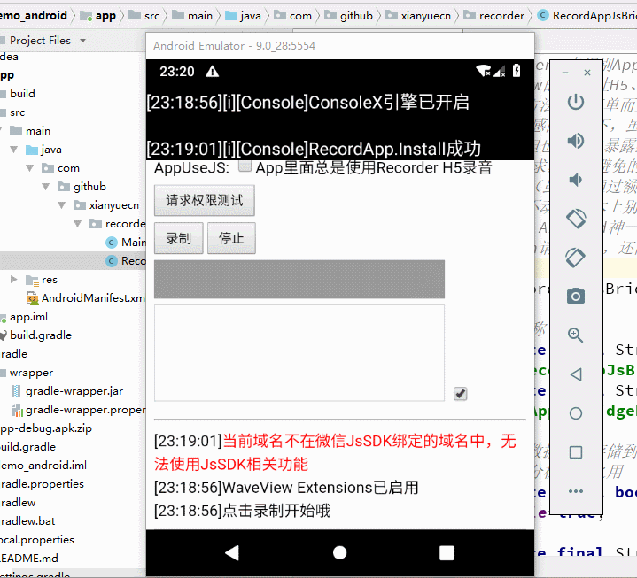

[Recorder](https://github.com/xiangyuecn/Recorder/) | [RecordApp](https://github.com/xiangyuecn/Recorder/tree/master/app-support-sample)

# :open_book:Android Hybrid App

目录内包含Android App测试源码，和核心文件 [RecordAppJsBridge.java](https://github.com/xiangyuecn/Recorder/blob/master/app-support-sample/demo_android/app/src/main/java/com/github/xianyuecn/recorder/RecordAppJsBridge.java) ；目录内 [app-debug.apk.zip](https://xiangyuecn.github.io/Recorder/app-support-sample/demo_android/app-debug.apk.zip) 为打包好的debug包（40kb，删掉.zip后缀），或者clone后自行用`Android Studio`编译打包。本demo为java代码，兼容API Level 15+，已测试Android 9.0。

本Demo是对[/app-support-sample/native-config.js](https://github.com/xiangyuecn/Recorder/blob/master/app-support-sample/native-config.js)配置示例中定义的JsBridge接口的实现。

可以直接copy目录内`RecordAppJsBridge.java`使用，此文件为核心文件，其他文件都是没什么价值的；支持新开发WebView界面，或对已有的WebView实例升级支持RecordApp。

## 【截图】

## 【限制】

- 虽然兼容API Level 15+，但实际上17+才是好的选择，因为addJavascriptInterface
- 古董WebView(21-)虽然能正常接收PCM和进行MP3、WAV编码，但对Blob对象的播放不一定能良好支持

# :open_book:原理

通过addJavascriptInterface往WebView注入一个全局对象`RecordAppJsBridge`，js中通过`window.RecordAppJsBridge`来访问，只有存在这个对象，就代表是在App中；js通过这个对象的`request`方法和java进行数据的交互。

## 数据交互
java收到js发起的`RecordAppJsBridge.request`请求，解析请求数据参数，并调用参数中接口对应的java方法，同步执行完后把数据返回给js，如果方法是异步的，将在异步操作完成后java将调用网页的js方法`AppJsBridgeRequest.Call`将数据异步返回。

## 录音接口
接口对应的方法使用的`AudioRecord`来录音，`AudioRecord`使用稳健的44100采样率进行音频采集，我们实时接收PCM数据并进行采样率的转换，然后调用`AppJsBridgeRequest.Record`把数据返回给js端即可完成完整的录音功能。

Android端的录音还算完美，比IOS的轻松很多。

## 为什么不用UserAgent来识别App环境

通过修改WebView的UA来让H5、服务器判断是不是在App里面运行的，此方法非常简单而且实用。但有一个致命缺陷，当UA数据很敏感的场景下，虽然方便了我方H5、服务器来识别这个App，但也同时也暴露给了任何在此WebView中发起的请求，不可避免的会将我们的标识信息随请求而发送给第三方（虽然可通过额外编程把信息抹掉，但代价太大了）。IOS不动UA基本上别人的服务器几乎不太可能识别出我们的App，Android神一样的把包名添加到了X-Requested-With请求头中，还能不能讲理了。

